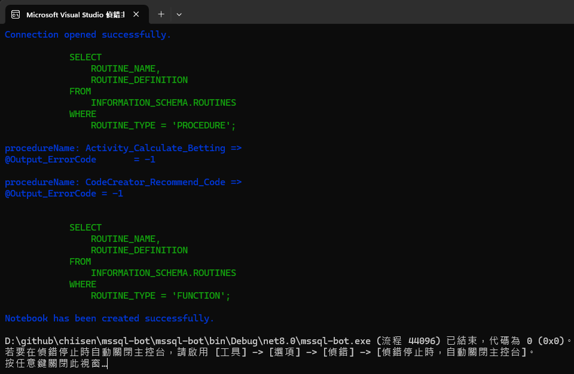

# mssql-bot
1. MS-SQL 語法檢查機器人  
2. MS-SQL 變更通知 Discord 機器人  

# 初始設定
必須本地安裝 Redis  
並建立 key 為 `mssql-bot:mssql-bot-connectionString`  
如果有帶入參數如下:  
```
mssql-bot checksp DEV
```
key 則為 `mssql-bot:mssql-bot-connectionString_DEV`  
Redis 內容如下:  
```json
{
    "connectionString": "Data Source=【連線網址】;Initial Catalog=【資料庫名稱】;User ID=【帳號】;Password=【密碼】;Connect Timeout=30;Encrypt=False;TrustServerCertificate=False;ApplicationIntent=ReadWrite;MultiSubnetFailover=False;Pooling=true;Min Pool Size=10;Max Pool Size=150;"
}
```
git 目錄路徑 key 為 `mssql-bot:mssql-bot-backup`  
有參數 DEV 則 key 為 `mssql-bot:mssql-bot-backup_DEV`  
```
D:\DB_Backup\
```
Discord 的 WebHook key 為 `mssql-bot:mssql-bot-discord`  
有參數 DEV 則 key 為 `mssql-bot:mssql-bot-discord_DEV`  
```
https://discord.com/api/webhooks/....
```

# 使用情境1
最近在使用 DBA 提供的儲存程序（SP）進行調用時，  
發生 SP 執行時的例外情況。  
為了解決這個問題，我寫了一個簡單的機器人，  
用於對 SP 進行簡單的除錯，從而避免在應用程序呼叫 SP 時發生例外。  
目前情境是 DBA 新增 output 參數 @Output_ErrorCode 型別為 tinyint 卻給負值，  
導致 SP 運行發生例外，事後反應溝通後，  
卻無法保證是否所有 SP 有類似狀況的問題，  
於是基於自救的需求，誕生次款機器人工具，  
後續有類似情境也可修改擴充使用。  

## 使用 SQL 語法
目前使用語法如下:  
- 列出所有 SP 的 SQL 腳本  
```sql
    SELECT 
    p.name AS ROUTINE_NAME, 
    m.definition AS ROUTINE_DEFINITION 
FROM 
    sys.procedures AS p
JOIN 
    sys.sql_modules AS m ON p.object_id = m.object_id;
```

## 執行方法
- 命令模式執行下面指令:
```
mssql-bot checksp
或
mssql-bot checksp DEV
```
依據情境先給命令為 checksp，需要時可再新增命令


執行後會把 `@Output_ErrorCode` 被付值為負值的地方列印在畫面上  
例如上圖畫面上的藍色字體，如下:
```json
procedureName: Activity_Calculate_Betting =>
@Output_ErrorCode       = -1

procedureName: CodeCreator_Recommend_Code =>
@Output_ErrorCode = -1
```
就是找到有問題的 SP 名稱與執行語法(在 Redis 上可見 SQL 腳本完證內容)  

## 調整查詢規則
```
var pattern = @"@Output_ErrorCode\s*=\s*-\d+";
```
上面語法為正規表達式查詢 `@Output_ErrorCode =` 為負值的部分  
可以依據需求調整上述查詢語法

# 使用情境2
最近 DBA 經常性的修改 SP 或函示但是不通知相關人員，為了自立救助，  
所以寫了機器人，每 10 分鐘做一次比對差異，  
並且 commit 到本地的 git 目錄，方便查找變更。  

## 使用 SQL 語法
目前使用語法如下:  
- 列出所有 SP 的 SQL 腳本  
```sql
    SELECT 
    p.name AS ROUTINE_NAME, 
    m.definition AS ROUTINE_DEFINITION 
FROM 
    sys.procedures AS p
JOIN 
    sys.sql_modules AS m ON p.object_id = m.object_id;
```
- 列出所有函式的 SQL 腳本  
```sql
    SELECT 
    f.name AS ROUTINE_NAME, 
    m.definition AS ROUTINE_DEFINITION 
FROM 
    sys.objects AS f
JOIN 
    sys.sql_modules AS m ON f.object_id = m.object_id
WHERE 
    f.type IN ('FN', 'IF', 'TF')
    ORDER BY ROUTINE_NAME ASC;
```

## 輸出格式
格式為 Json 檔案，VSCode 有支持此格式的套件可使用，並且可以直接開啟 `*.json` 的檔案  
1. stored_procedures.json  
2. functions.json  
並且儲存到 git 目錄中，並用 discord 通知變更  

## 執行方法
- 命令模式執行下面指令:  
```
mssql-bot checkdiffsp
或
mssql-bot checkdiffsp DEV
```
依據情境先給命令為 checkdiffsp，需要時可再新增命令  

# 參考
查詢所有安裝的 .NET 版本
```
dotnet --list-sdks
```